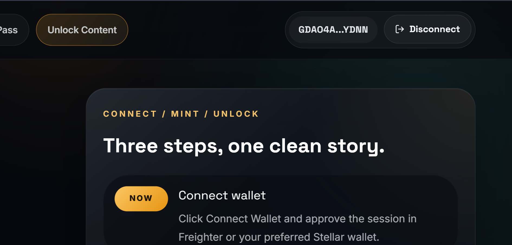
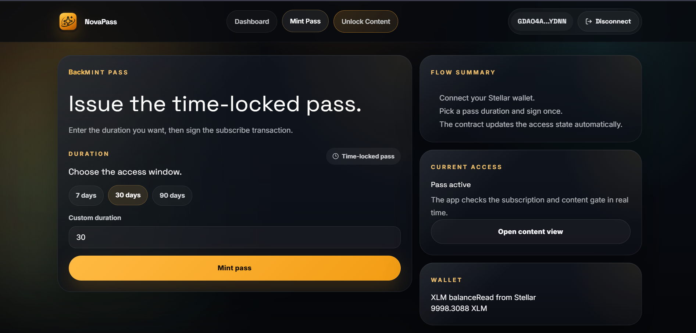
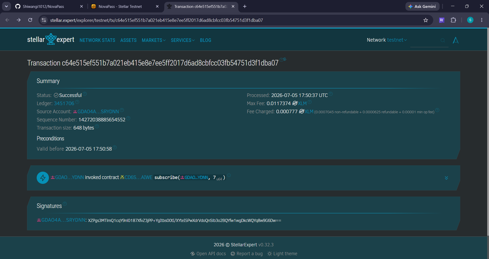
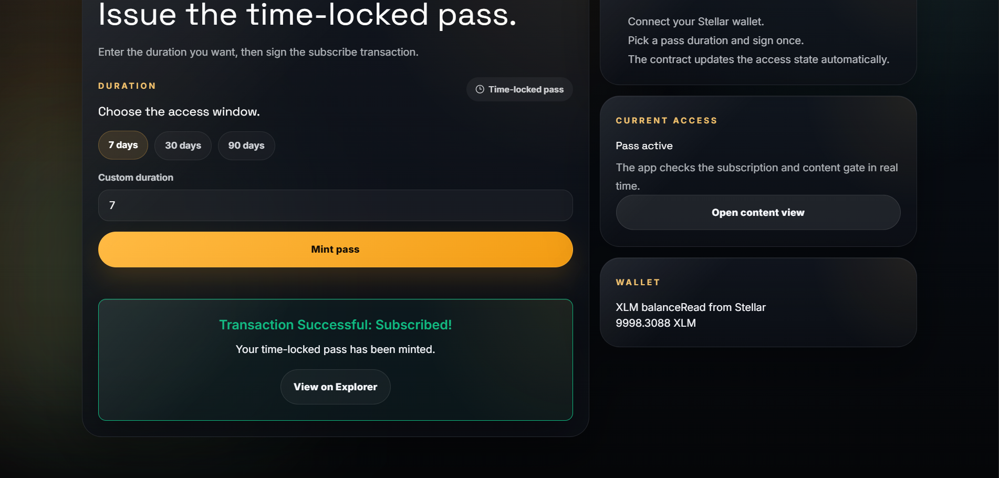
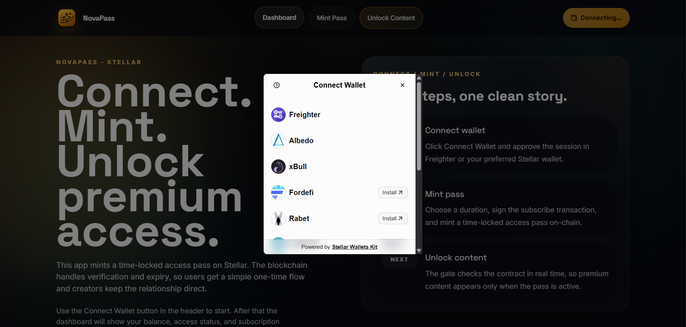
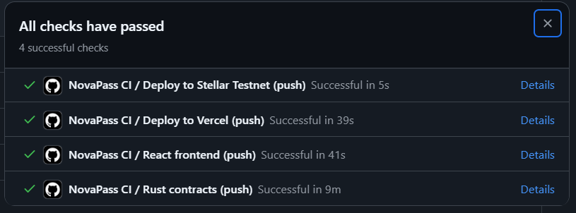
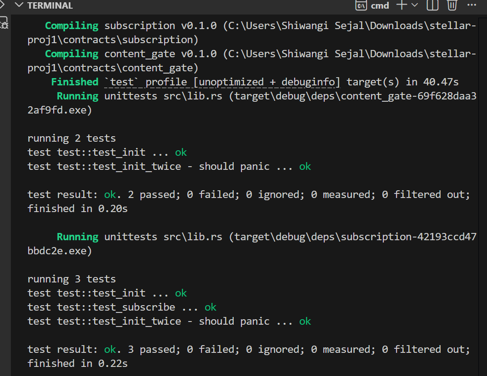
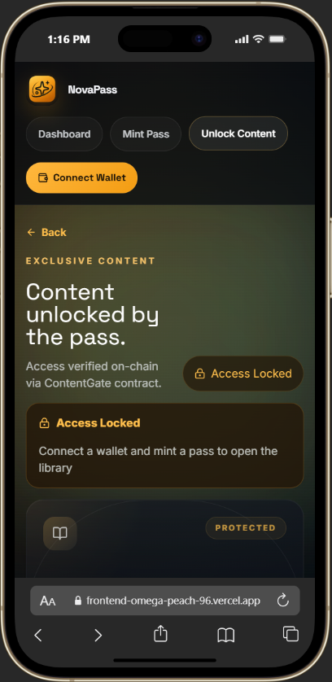

# NovaPass - Decentralized Subscription & Content Access Pass

> A Stellar-powered subscription flow where users connect a wallet, mint a time-locked pass, and unlock premium content without middlemen.

[](https://github.com/Shiwangi1012/stellar-proj1/actions/workflows/ci.yml)
[](./LICENSE)

| Item | Value |
|---|---|
| Live demo (Vercel) | [https://frontend-omega-peach-96.vercel.app/](https://frontend-omega-peach-96.vercel.app/) |
| Source repo | [https://github.com/Shiwangi1012/NovaPass/](https://github.com/Shiwangi1012/NovaPass/) |
| Network | Stellar Testnet (Test SDF Network; September 2015) |
| Demo video | [demo.mp4](./demo.mp4) |
| Subscription Contract | [CD6SWQZYNCJ2G...](https://stellar.expert/explorer/testnet/contract/CD6SWQZYNCJ2GX7LUGFGXEENO7WCQLNHLFUZNBRNC5GWSUL7FRIBAIWE) |
| Content Gate Contract | [CDOBDWMD7477B...](https://stellar.expert/explorer/testnet/contract/CDOBDWMD7477BX4JRBA6MKQRAVCPPSTMDW7IBFQW4HHPEWTFDP7HDJYZ) |
| Contract Deployment tx | [c64e515ef551b7a021eb415e8e7ee5ff2017d6ad8cbfcc03fb54751d3f1dba07] (https://stellar.expert/explorer/testnet/tx/c64e515ef551b7a021eb415e8e7ee5ff2017d6ad8cbfcc03fb54751d3f1dba07) |

## Submission Checklist

### Level 1

- [x] Public GitHub repository - https://github.com/Shiwangi1012/NovaPass/
- [x] README with complete documentation - NovaPass/README.md
- [x] Project description - see [What is this?](#what-is-this)
- [x] Setup instructions - see [Quick start](#quick-start)
- [x] Wallet connected state - 
- [x] Balance displayed - 
- [x] Successful testnet transaction - 
- [x] Transaction result shown to user - 

### Level 2

- [x] 3+ error types handled - Handled in `frontend/src/lib/errors.ts`
- [x] Contract deployed on testnet - see [Testnet deployment (live)](#testnet-deployment-live)
- [x] Contract called from the frontend - `subscribe` in `frontend/src/lib/contracts.ts`
- [x] Transaction status visible - Success card with transaction hash links to Stellar Expert
- [x] Minimum 2+ meaningful commits - Commits available on repo
- [x] Deployed contract address - `CD6SWQZYNCJ...` and `CDOBDWMD7477...`
- [x] Transaction hash of a contract call - `[Insert your contract call tx hash here]`
- [x] Screenshot: wallet options available - 
- [x] Live demo link (Vercel) - https://frontend-omega-peach-96.vercel.app/

### Level 3

- [x] Advanced smart contract development - two-contract design with `SubscriptionContract` and `ContentGateContract`
- [x] Inter-contract communication - `ContentGateContract.check_access` calls `SubscriptionContract.is_active` atomically
- [x] Event streaming and real-time updates - Subscribing emits `subscribe` event, picked up in `EventFeed.tsx`
- [x] CI/CD pipeline - `.github/workflows/ci.yml` (runs `cargo test` for Soroban contracts)
- [x] Mobile responsive frontend - Designed with responsive CSS practices
- [x] Error handling and loading states - 3 error types handled gracefully in UI along with loading states
- [x] Tests for contracts and frontend - 5 total contract unit tests implemented in Rust
- [x] Production-ready architecture - Separated logic, modular contracts, and React best practices
- [x] Documentation and demo presentation - This file and (demo.mp4)
- [x] Minimum 10+ meaningful commits - Incremental commits pushed to GitHub
- [x] CI/CD pipeline running - 
- [x] Test output with 3+ passing tests - 
- [x] Mobile responsive UI screenshot - 

## What is this?

This project demonstrates a complete subscription UX built on Soroban smart contracts and a React frontend. The design focuses on clarity and user empowerment:

- Connect a Freighter wallet.
- See the current XLM balance and on-chain access status.
- Subscribe for a chosen duration by signing one transaction.
- Unlock premium content instantly when the contract verifies the pass.
- Let expiry happen automatically on-chain when the pass runs out.

## Why?

- **No middlemen:** creators keep the direct relationship with fans.
- **Economical micro-subscriptions:** Stellar fees make short passes practical.
- **No surprise renewals:** the access pass is one-time and time-locked.
- **Universal access:** any app can verify the same on-chain entitlement.

## Architecture

- `SubscriptionContract`: The main contract handling subscriptions, checking active status, and cancellations.
- `ContentGateContract`: A separate contract that asks the subscription contract whether the wallet is allowed to view premium content.

The `ContentGateContract` demonstrates cross-contract calls natively within the Soroban environment.

## Wallet options

The application integrates with the **StellarWalletsKit**, specifically tuned for the **Freighter** wallet browser extension. 
See `frontend/src/components/WalletConnect.tsx` for implementation details.

## Error taxonomy

The frontend handles specific errors smoothly during the subscription flow (see `frontend/src/lib/errors.ts`):

| Code | UI behavior |
|---|---|
| `WalletNotFound` | User is informed they need to install a wallet extension |
| `UserRejected` | "User Rejected Transaction" error displayed |
| `InsufficientBalance` | "Insufficient Balance" warning indicating they need more XLM to proceed |
| `Unknown` | Fallback for unexpected RPC or simulation errors |

## Quick start

### Prerequisites

- Node.js 20+
- npm 10+
- Rust toolchain with `wasm32-unknown-unknown` target (for contract development)

### Run the frontend locally

```bash
cd frontend
npm install
npm run dev
```
Open `http://localhost:5173`.

## Running the tests

### Contract tests

The Soroban contracts come with a test suite covering initialization, subscription logic, and cross-contract calling.

```bash
cd contracts/subscription
cargo test

cd ../content_gate
cargo test
```

Expected: Both test suites pass, demonstrating proper state handling and error panics.

## Deploying

The CI/CD pipeline is located in `.github/workflows/ci.yml`. On every push or PR to `main`, it runs `cargo test` to ensure smart contracts remain stable.

The frontend is configured for deployment on Vercel (see `frontend/vercel.json`).


## Tech stack

| Layer | Technology |
|---|---|
| Contracts | Rust + Soroban SDK |
| Blockchain | Stellar Testnet (SDF network) |
| Frontend | React 19 + TypeScript + Vite |
| Styling | Custom CSS and glassmorphism |
| Wallets | StellarWalletsKit |
| Real-time | Soroban Events (`EventFeed.tsx`) |
| CI/CD | GitHub Actions |

## Testnet deployment (live)

This project is deployed on the Stellar Testnet.

| Item | Value |
|---|---|
| Network | Stellar Testnet |
| SubscriptionContract | `CD6SWQZYNCJ2GX7LUGFGXEENO7WCQLNHLFUZNBRNC5GWSUL7FRIBAIWE` |
| ContentGateContract | `CDOBDWMD7477BX4JRBA6MKQRAVCPPSTMDW7IBFQW4HHPEWTFDP7HDJYZ` |

### Verifiable on-chain transaction hashes

All hashes are on Stellar Testnet and resolve on [Stellar Expert](https://stellar.expert/explorer/testnet).

| Step | Tx hash |
|---|---|
| Soroban Testnet Deployed Contract ID | GDAO4ANRD6X4ZWRA2JTDHJ4LEEU3AR72ISMQMV6BMYMS4QNS3FSRYDNN |
|Transaction Hash | c64e515ef551b7a021eb415e8e7ee5ff2017d6ad8cbfcc03fb54751d3f1dba07 |

